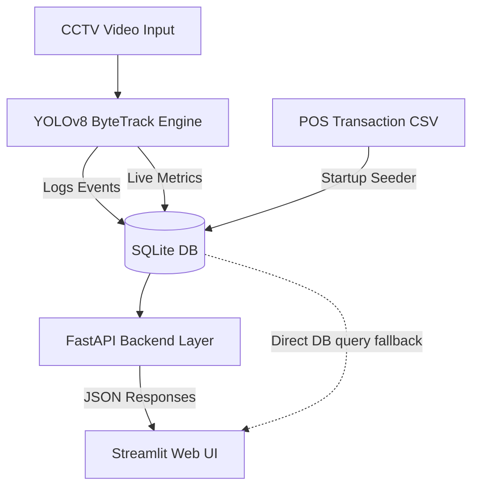

# 🔮 Purplle CCTV Store Intelligence System

### 🏆 Purplle Tech Challenge 2026 - Round 2 MVP Submission
A production-ready Computer Vision & Store Analytics solution designed to transform passive retail CCTV feeds into actionable business intelligence.

---

## 📌 1. Problem Statement

Modern offline retail stores (like Purplle outlets) generate massive amounts of video data through security cameras. However, this data is rarely utilized for operational optimization. Retailers face critical blind spots:
1. **Inefficient Staffing**: Lack of real-time traffic data leads to under-staffed hours during peaks and over-staffed hours during slumps.
2. **Invisible Customer Journeys**: No metrics on customer dwell time (how long shoppers interact with cosmetic shelves) or billing queue bottlenecks.
3. **Delayed Incident Detection**: Crowd build-ups at checkout counters and security issues like loitering are only recognized after they cause drop-offs or security breaches.
4. **Poor Conversion Attribution**: Inability to correlate offline visual footfalls with Point-of-Sale (POS) transactions.

### **The Solution**
The **Purplle CCTV Store Intelligence System** bridges this gap. By utilizing edge-compatible **YOLOv8** deep learning models, the system tracks customer occupancy, calculates zone dwell times, detects crowding/loitering anomalies, and correlates visual entries with POS transaction logs to deliver **live store conversion rates** and **operational health scores**.

---

## 🏗️ 2. System Architecture

The MVP utilizes a decoupled, high-performance, edge-first architecture:

1. **CV Processing Layer (`backend/processor.py`)**: Uses a pre-trained **YOLOv8 Nano** object detector paired with a Kalman-filter tracker to assign stable IDs to shoppers.
2. **Database Layer (`backend/database.py`)**: A transactional **SQLite** engine storing structural events, camera density states, and transaction histories.
3. **Service Layer (`backend/main.py`)**: A developer-friendly **FastAPI** web service exposing OpenAPI-compliant endpoints.
4. **Dashboard Layer (`frontend/dashboard.py`)**: A modern **Streamlit** dashboard featuring a dark-purple visual theme, interactive Plotly charts, a Graphviz architectural flow map, and a live computer vision processing emulator.

---

## ✨ 3. Core Features

- **Live Occupancy Monitoring**: Shows the exact number of customers currently active across all cameras.
- **Dwell Time Tracker**: Tracks individual shopper duration at cosmetic shelves (Mumbai Metro & Pune Galleria layouts).
- **Automated Event Logger**: Generates structured JSON records for:
  - `PERSON_ENTERED`: Triggers on entry camera detection.
  - `PERSON_EXITED`: Triggers when tracking is lost.
  - `CROWD_ALERT`: Triggers if count $\ge 4$ shoppers in view.
  - `LOITERING_ALERT`: Triggers if a customer stays at a shelf for $\ge 15.0$ seconds.
- **Conversion Rate Analytics**: Merges entry counts with POS transaction counts to show real-time shopper-to-buyer ratios.
- **Store Health Score**: An operational health metric (out of 100) calculated dynamically using active congestion parameters and conversion indicators.
- **Serverless Cloud Portability**: Features a direct database query fallback, allowing the dashboard to run without the FastAPI server when deployed to serverless environments (like Streamlit Cloud).

---

## 🔌 4. API Documentation

The FastAPI service hosts standard endpoints (fully documented at `http://localhost:8000/docs`):

| Endpoint | Method | Description |
|---|---|---|
| `/metrics/live` | `GET` | Live density and alert states by camera |
| `/events` | `GET` | Historical retail logs with type and camera filters |
| `/anomalies` | `GET` | List of Crowd Alerts and Loitering Alerts |
| `/store/summary` | `GET` | Key analytics (total footfall, revenue, conversion rate, dwell time, busy hours) |
| `/database/reset` | `POST` | Wipes database tables and re-seeds from CSV/JSONL |

---

## 🌐 5. Deployment Link

🚀 **Streamlit Cloud Live App**: *[https://purplle-cctv-intelligence.streamlit.app](https://purplle-cctv-intelligence.streamlit.app)*  
*(The deployment is fully pre-seeded with POS transaction records and historical logs, operating in standalone Cloud Demo Mode).*

---

## 📸 6. Screenshots & Visuals

### **Floor Plan Map (Store Layout)**

*(You can see additional interactive layout screenshots in the **System Architecture** tab directly on the Streamlit dashboard).*

---

## 🔮 7. Future Scope & Roadmap

If selected for Round 3, we plan to implement:
1. **Multi-Camera Re-Identification (Re-ID)**: Track a shopper's journey across blind spots when transitioning between camera views using feature embeddings.
2. **Staff/Customer Filtering**: Train a classifier (e.g., using color histograms) to detect store uniforms and subtract employee movement from footfall counts.
3. **Predictive Queue Management**: Train LSTM networks to predict billing queue overflows 10 minutes in advance, notifying supervisors to open new billing counters.
4. **Heatmap Generation**: Render density-based visual overlay heatmaps directly on store floor plan images to identify layout bottlenecks.