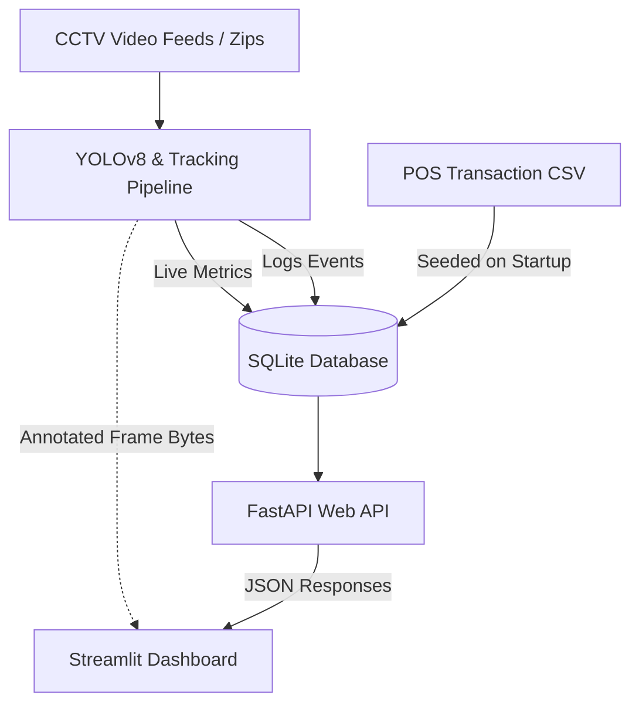

# Architecture & Design Document

## CCTV Store Intelligence System

This document outlines the technical architecture, data pipeline, detection algorithms, and API contracts for the CCTV Store Intelligence System MVP.

---

## 1. High-Level Architecture Overview

The system consists of three major layers:
1. **Computer Vision & Event Processing Pipeline**: Processes camera streams using YOLOv8, tracks customers, and detects behavioral indicators (dwell time, crowd events).
2. **FastAPI Web Service Layer**: Exposes standardized APIs to retrieve live occupancy metrics, event logs, loitering alerts, and store conversion aggregates.
3. **Streamlit Executive Dashboard**: A rich web dashboard presenting key business performance metrics (KPIs), traffic graphs, brand-wise sales analysis, and an interactive CCTV playback simulator.



---

## 2. Component Design

### 2.1 Computer Vision & Tracking Engine (`backend/processor.py`)
- **Detection Model**: YOLOv8 Nano (`yolov8n.pt`). YOLOv8 uses a Backbone-Neck-Head architecture that provides extremely high inference speeds on CPU/GPU.
- **Tracking Algorithm**: ByteTrack (native to YOLOv8's `model.track()`). It works by matching detection boxes across consecutive frames based on spatial overlap (IoU) and Kalman filtering, assigning stable integer track IDs (`person_id`) to individual shoppers.
- **Category Filter**: Filters detections to keep only class `0` (Person).

### 2.2 Event Detection Heuristics
- **PERSON_ENTERED**: Triggered when a new `track_id` is matched for the first time in the video feed.
- **PERSON_EXITED**: Triggered when a previously active `track_id` has not been detected for a continuous duration of 10 processed frames (approximately 2 seconds of video time).
- **CROWD_ALERT**: Triggered when the number of active bounding boxes in a single frame equals or exceeds the crowd threshold (default: `4` people).
- **LOITERING_ALERT**: Triggered when an active `track_id` persists in the camera view for longer than the loitering threshold (default: `15.0` seconds). The system records the entry time and calculates:
  $$\text{Dwell Time} = \text{Current Video Timestamp} - \text{First Seen Video Timestamp}$$

---

## 3. Database Schema

The SQLite database (`store_intelligence.db`) houses three main tables:

### `events`
Logs all discrete computer vision events.
- `id` (INTEGER, Primary Key, Auto-increment)
- `event_type` (TEXT) - e.g., `PERSON_ENTERED`, `PERSON_EXITED`, `CROWD_ALERT`, `LOITERING_ALERT`
- `timestamp` (TEXT, ISO 8601 string)
- `camera_id` (TEXT)
- `person_id` (INTEGER, Nullable)
- `details` (TEXT, JSON string for metadata)

### `live_metrics`
Holds the current live state of the store for quick retrieval.
- `camera_id` (TEXT, Primary Key)
- `current_count` (INTEGER)
- `crowd_alert` (INTEGER, boolean flag)
- `last_updated` (TEXT, ISO 8601 string)

### `pos_transactions`
Logs Point of Sale transactions to allow conversion and basket size correlation.
- `order_id` (INTEGER, Primary Key)
- `order_date` (TEXT)
- `order_time` (TEXT)
- `store_id` (TEXT)
- `product_id` (TEXT)
- `brand_name` (TEXT)
- `total_amount` (REAL)

---

## 4. API Endpoints Contract

### `GET /metrics/live`
Returns live shopper density and alert status by camera.
**Response**:
```json
[
  {
    "camera_id": "cam3_display",
    "current_count": 5,
    "crowd_alert": true,
    "last_updated": "2026-06-04T18:10:00"
  }
]
```

### `GET /events`
Returns list of all events, with query filters `event_type` and `camera_id`.
**Response**:
```json
[
  {
    "id": 1,
    "event_type": "PERSON_ENTERED",
    "timestamp": "2026-03-08T18:10:05.120000",
    "camera_id": "cam1",
    "person_id": 1,
    "details": {"gender_pred": "F", "age_pred": 28}
  }
]
```

### `GET /anomalies`
Returns events matching `CROWD_ALERT` or `LOITERING_ALERT`.
**Response**:
```json
[
  {
    "id": 12,
    "event_type": "LOITERING_ALERT",
    "timestamp": "2026-03-08T18:12:05.520000",
    "camera_id": "cam2",
    "person_id": 102,
    "details": {"duration_seconds": 22.5, "zone_name": "Left Shelf"}
  }
]
```

### `GET /store/summary`
Calculates business analytical summaries by merging CCTV traffic and POS transaction data.
**Response**:
```json
{
  "total_visitors": 128,
  "total_crowd_alerts": 4,
  "total_loitering_alerts": 2,
  "total_transactions": 100,
  "total_revenue": 45320.50,
  "conversion_rate_percentage": 78.13,
  "hourly_traffic": {"18": 56, "19": 48},
  "brand_revenue": [
    {"brand": "Faces Canada", "revenue": 24500.00, "transactions": 60}
  ]
}
```

---

## 5. Deployment Architecture

The application can be deployed as a single Docker container or multi-container service on AWS, GCP, or a local server.
- The `Dockerfile` provides a Debian slim environment that pre-installs `ffmpeg` and OpenCV libraries, installs requirements, caches the YOLOv8 model weights inside `/root/.config/Ultralytics/yolov8n.pt` to ensure offline availability, and launches the services.
- The `run.py` supervisor script ensures database seeding happens automatically on startup and monitors both sub-processes, graceful shut downs are implemented.
